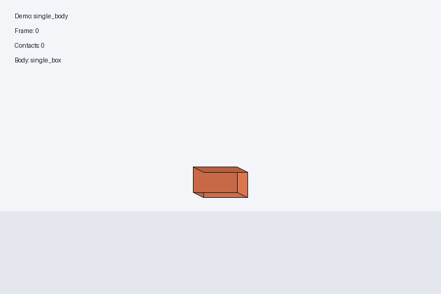
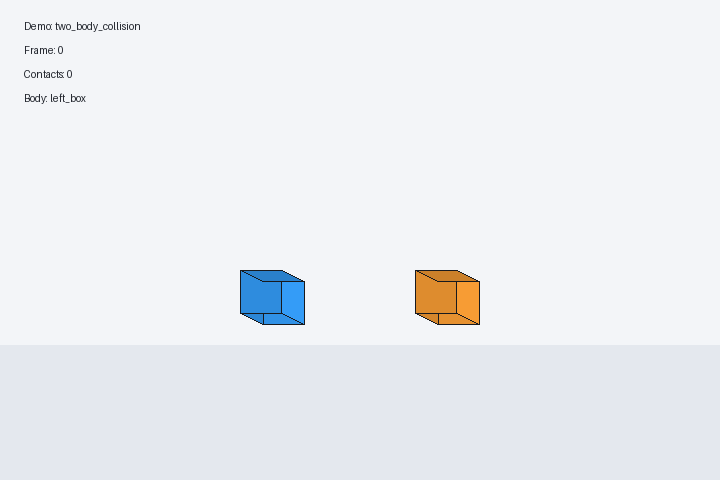
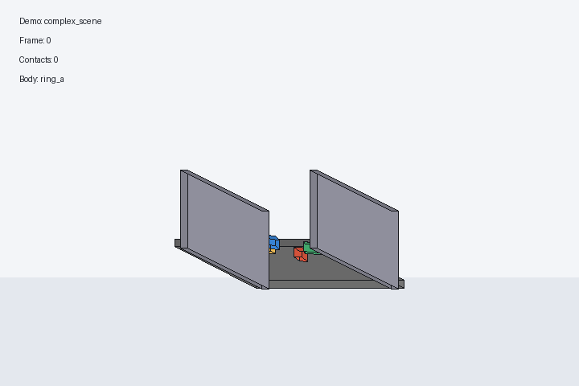

# Lab 1 刚体仿真作业报告

白晨旭 2300011172

## 1. 项目说明

本次作业实现了一个基于 Python + Taichi 的长方体刚体仿真框架，完成了 handout 要求的三个 demo：

1. 单刚体运动与交互
2. 两刚体碰撞检测与冲量响应
3. 含地板/墙面/重力/多刚体接触的复杂场景

本次提交记录已经导出到根目录的 [lab1_log.txt](./lab1_log.txt)。

## 2. 核心思路

### 2.1 状态表示

- 刚体使用位置 `position`、四元数朝向 `orientation`、线速度 `linear_velocity`、角速度 `angular_velocity` 表示。
- 长方体在 body frame 下的惯性张量使用解析公式计算，世界系逆惯量通过
  `R * I_body^{-1} * R^T` 得到。
- 为了支持重置 demo，保存了每个刚体的初始 snapshot。

### 2.2 时间推进

整体仿真采用逐步推进：

1. 清空瞬时力和接触缓存
2. 累积重力与用户交互输入
3. 更新线速度与角速度
4. 做碰撞检测
5. 做冲量法碰撞响应
6. 更新位置与朝向
7. 在复杂场景里做休眠判断，降低持续抖动

Demo1 和 Demo2 使用 CPU 路径；Demo3 额外接入了一个 Taichi step backend 来加速积分热路径。

### 2.3 Demo1：单刚体

- 用显式 Euler 做线速度与角速度积分。
- 用四元数积分朝向，并在每步后归一化。
- 支持外力/冲量交互，用来验证刚体的平动与转动更新是否正确。

### 2.4 Demo2：两刚体碰撞

- 碰撞检测采用基于 SAT 的 OBB-OBB 检测。
- 支持 face-face、edge-edge、point-face 和随机姿态 case。
- 碰撞响应采用 impulse-based 方法：
  - 法向冲量用于分离物体
  - 摩擦冲量用于处理切向相对速度
  - 额外做了轻量的位置修正，减小穿透

### 2.5 Demo3：复杂场景

- 场景包含固定地板与墙面、重力，以及四个长方体。
- 四个长方体随机初始化在圆周附近，并带有朝圆心的初速度，因此会在中心区域产生多次相互碰撞。
- 静态边界接触使用多接触点 `boundary manifold`，而不是简单单点接触，避免“一点着地就稳定平衡”的不合理现象。
- 复杂场景中加入了 support-based sleeping，减少长时间轻微抖动。
- Demo3 打开了 `use_taichi_step`，将积分热路径放到 Taichi kernel 中执行。

## 3. 运行方法

### 3.1 环境配置

项目使用 `uv` 管理环境：

```bash
uv sync
```

### 3.2 运行程序

```bash
uv run python main.py --demo single_body --steps 0
uv run python main.py --demo two_body_collision --steps 0
uv run python main.py --demo complex_scene --steps 0
```

说明：

- `--steps 0` 表示一直运行，直到手动关闭窗口
- `--demo` 可选：`single_body`、`two_body_collision`、`complex_scene`

### 3.3 运行测试

```bash
uv run pytest -q
```

## 4. 交互方法

### 通用交互

- `Tab`：循环切换 demo
- `R`：重置当前 demo
- `P`：暂停/继续
- `Esc`：退出

### Demo1

- `W/A/S/D/Q/E`：对当前刚体施加外力

### Demo2

- `B / N`：切换碰撞 case
- 当前实现包含 `point_face`、`edge_edge`、`face_face`、`random_pose`

### Demo3

- `RMB + WASD/EQ`：移动相机
- `LMB drag`：拖拽当前选中的长方体
- `B / N`：切换当前选中的长方体

## 5. Demo 展示

### Demo1：单刚体



### Demo2：两刚体碰撞



### Demo3：复杂场景



## 6. Git 提交记录说明

完整提交统计见 [lab1_log.txt](./lab1_log.txt)。

## 7. 总结

本次作业完成了 handout 要求的三个刚体 demo，并补充了基础单元测试、交互控制与报告演示图。实现过程中重点处理了：

- 四元数刚体姿态更新
- SAT 长方体碰撞检测
- 基于冲量的碰撞响应
- 多刚体复杂场景下的边界接触与 sleeping

